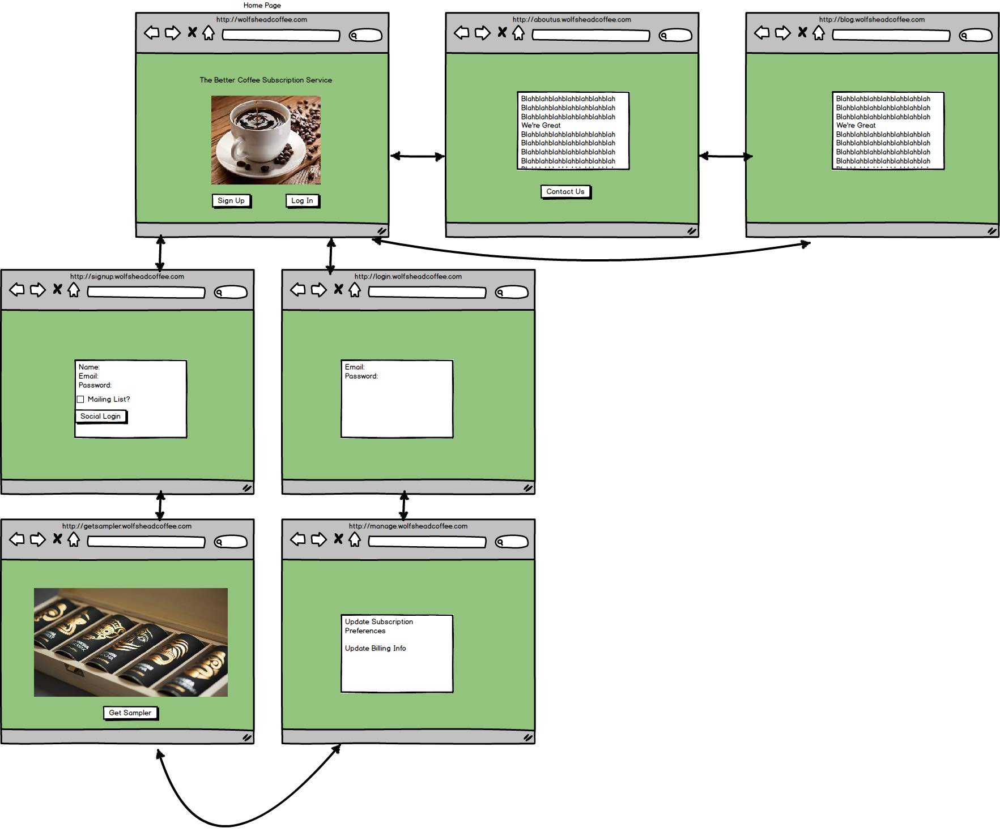
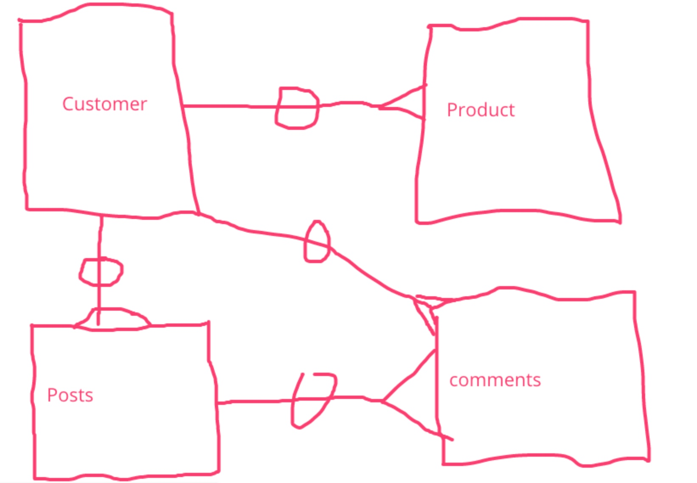
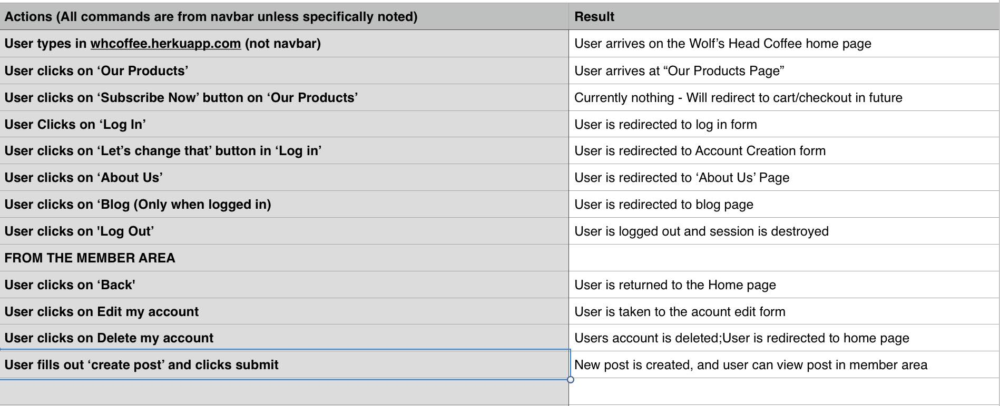

##Project 2

####Wireframes

-
####Entity Relationship Diagram

-
####User Stories

-
##The Wolf's Head Coffee App 
For Project 2, I decided to try and design an app with real-world implementation potential. My company is in the process of launching a coffee wholesale and delivery service, so I wanted to get as close as I could to a fully functional site for it. 

##Technologies Used
* Ruby 2.2.1
* Rails 4.2.5
* Bootstrap-Sass Gem v3.2.0 For Styling
* Bcrypt Gem For Encryption
* Figaro Gem to hide any & all keys stored within the app
* AWS-SDK Gem to host any user-uploaded images in the future
* Balsamiq 3 was utilized for Wireframing
* No scaffolding/Hand-rolled Encryption & Authorization
* Heroku for deployment
* InVision for ERD
* PostgreSQL for the database.

I followed the bash console creation methods (rails g new, rails g new model, rails g new migration, etc). To install, fork down, and run bundle install in the terminal. Initially, I had installed the Stripe Gem to process recurring subscription payments, but after determining that the installation of the gem had been corrupted, I moved on. In order to accurately represent a one to many model relationship, I began to build a blog after fully styling my page. As of presentation time, when a customer makes a new post, it appears on the customer show page, but it does not render on the blog index page yet. Additionally, the "Blog" section does not appear in the nav bar until after a customer logs in successfully.Overall, I am pleased with my project. It is my first full-stack app, and I am very happy with the initial concept, the site's layout, and the knowledge I gained while building it. 